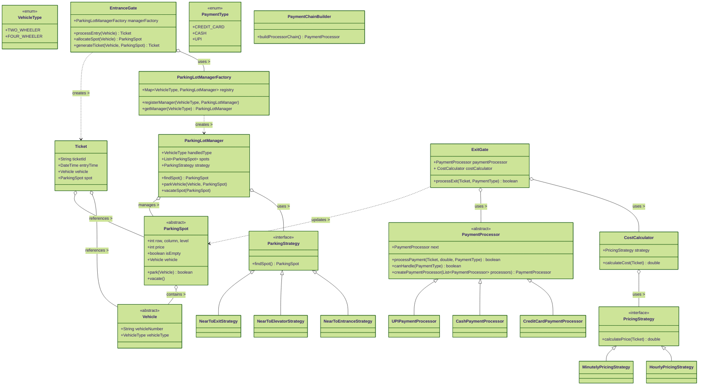

```mermaid
%%{init: {'theme':'forest'}}%%
classDiagram

    %% Core Domain Components
    class Vehicle {
        <<abstract>>
        +String vehicleNumber
        +VehicleType vehicleType
    }

    class VehicleType {
        <<enum>>
        +TWO_WHEELER
        +FOUR_WHEELER
    }
    
    %% Parking Spot Hierarchy (Template Pattern)
    class ParkingSpot {
        <<abstract>>
        +int row, column, level
        +int price
        +boolean isEmpty
        +Vehicle vehicle
        +park(Vehicle) boolean
        +vacate()
    }
    
    ParkingSpot o-- Vehicle : contains >
    
    %% Manager Components (Strategy Pattern)
    class ParkingStrategy {
        <<interface>>
        +findSpot() ParkingSpot
    }
    
    ParkingStrategy <|-- NearToEntranceStrategy
    ParkingStrategy <|-- NearToElevatorStrategy
    ParkingStrategy <|-- NearToExitStrategy
    
    class ParkingLotManager {
        +VehicleType handledType
        +List~ParkingSpot~ spots
        +ParkingStrategy strategy
        +findSpot() ParkingSpot
        +parkVehicle(Vehicle, ParkingSpot)
        +vacateSpot(ParkingSpot)
    }
    
    ParkingLotManager o-- ParkingStrategy : uses >
    ParkingLotManager o-- ParkingSpot : manages >

    %% Registry-based Factory for Vehicle Managers
    class ParkingLotManagerFactory {
        +Map~VehicleType, ParkingLotManager~ registry
        +registerManager(VehicleType, ParkingLotManager)
        +getManager(VehicleType) ParkingLotManager
    }
    
    ParkingLotManagerFactory ..> ParkingLotManager : creates >
    
    %% Ticket System
    class Ticket {
        +String ticketId
        +DateTime entryTime
        +Vehicle vehicle
        +ParkingSpot spot
    }
    
    Ticket o-- Vehicle : references >
    Ticket o-- ParkingSpot : references >
    
    %% Entry Gate (Facade Pattern)
    class EntranceGate {
        +ParkingLotManagerFactory managerFactory
        +processEntry(Vehicle) Ticket
        +allocateSpot(Vehicle) ParkingSpot
        +generateTicket(Vehicle, ParkingSpot) Ticket
    }
    
    EntranceGate o-- ParkingLotManagerFactory : uses >
    EntranceGate ..> Ticket : creates >
    
    %% Pricing System (Strategy Pattern)
    class PricingStrategy {
        <<interface>>
        +calculatePrice(Ticket) double
    }
    
    PricingStrategy <|-- HourlyPricingStrategy
    PricingStrategy <|-- MinutelyPricingStrategy
    
    class CostCalculator {
        +PricingStrategy strategy
        +calculateCost(Ticket) double
    }
    
    CostCalculator o-- PricingStrategy : uses >
    
    %% Payment System (Chain of Responsibility Pattern)
    class PaymentType {
        <<enum>>
        +CREDIT_CARD
        +CASH
        +UPI
    }

    class PaymentProcessor {
        <<abstract>>
        +PaymentProcessor next
        +processPayment(Ticket, double, PaymentType) boolean
        +canHandle(PaymentType) boolean
        +createPaymentProcessor(List~PaymentProcessor~ processors) PaymentProcessor
    }

    PaymentProcessor <|-- CreditCardPaymentProcessor
    PaymentProcessor <|-- CashPaymentProcessor
    PaymentProcessor <|-- UPIPaymentProcessor
    
    class PaymentChainBuilder {
        +buildProcessorChain() PaymentProcessor
    }

    
    class ExitGate {
        +PaymentProcessor paymentProcessor
        + CostCalculator costCalculator
        +processExit(Ticket, PaymentType) boolean
    }
    
    ExitGate o-- CostCalculator : uses >
    ExitGate o-- PaymentProcessor : uses >
    ExitGate ..> ParkingSpot : updates >
```