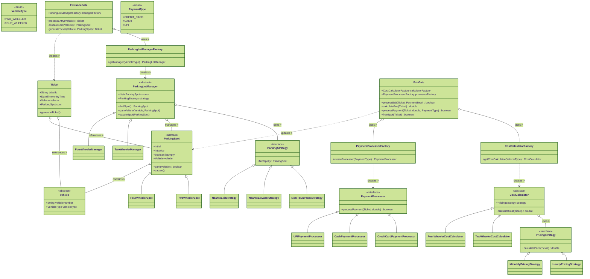

```mermaid
%%{init: {'theme':'forest'}}%%
classDiagram
    %% Core Domain Components
    class Vehicle {
        <<abstract>>
        +String vehicleNumber
        +VehicleType vehicleType
    }

    class VehicleType {
        <<enum>>
        +TWO_WHEELER
        +FOUR_WHEELER
    }
    
    %% Parking Spot Hierarchy (Template Pattern)
    class ParkingSpot {
        <<abstract>>
        +int id
        +int price
        +boolean isEmpty
        +Vehicle vehicle
        +park(Vehicle) boolean
        +vacate()
    }
    
    ParkingSpot <|-- TwoWheelerSpot
    ParkingSpot <|-- FourWheelerSpot
    ParkingSpot o-- Vehicle : contains >
    
    %% Manager Components (Strategy Pattern)
    class ParkingStrategy {
        <<interface>>
        +findSpot() ParkingSpot
    }
    
    ParkingStrategy <|-- NearToEntranceStrategy
    ParkingStrategy <|-- NearToElevatorStrategy
    ParkingStrategy <|-- NearToExitStrategy
    
    class ParkingLotManager {
        <<abstract>>
        +List~ParkingSpot~ spots
        +ParkingStrategy strategy
        +findSpot() ParkingSpot
        +parkVehicle(Vehicle, ParkingSpot)
        +vacateSpot(ParkingSpot)
    }
    
    ParkingLotManager o-- ParkingStrategy : uses >
    ParkingLotManager o-- ParkingSpot : manages >
    ParkingLotManager <|-- TwoWheelerManager
    ParkingLotManager <|-- FourWheelerManager
    
    %% Factory Pattern for Manager
    class ParkingLotManagerFactory {
        +getManager(VehicleType) ParkingLotManager
    }
    
    ParkingLotManagerFactory ..> ParkingLotManager : creates >
    
    %% Ticket System
    class Ticket {
        +String ticketId
        +DateTime entryTime
        +Vehicle vehicle
        +ParkingSpot spot
        +generateTicket()
    }
    
    Ticket o-- Vehicle : references >
    Ticket o-- ParkingSpot : references >
    
    %% Entry/Exit Gates (Facade Pattern)
    class EntranceGate {
        +ParkingLotManagerFactory managerFactory
        +processEntry(Vehicle) Ticket
        +allocateSpot(Vehicle) ParkingSpot
        +generateTicket(Vehicle, ParkingSpot) Ticket
    }
    
    EntranceGate o-- ParkingLotManagerFactory : uses >
    EntranceGate ..> Ticket : creates >
    
    %% Pricing System (Strategy Pattern)
    class PricingStrategy {
        <<interface>>
        +calculatePrice(Ticket) double
    }
    
    PricingStrategy <|-- HourlyPricingStrategy
    PricingStrategy <|-- MinutelyPricingStrategy
    
    class CostCalculator {
        <<abstract>>
        +PricingStrategy strategy
        +calculateCost(Ticket) double
    }
    
    CostCalculator o-- PricingStrategy : uses >
    CostCalculator <|-- TwoWheelerCostCalculator
    CostCalculator <|-- FourWheelerCostCalculator
    
    %% Factory Pattern for Cost Calculator
    class CostCalculatorFactory {
        +getCostCalculator(VehicleType) CostCalculator
    }
    
    CostCalculatorFactory ..> CostCalculator : creates >
    
    %% Payment System (Strategy Pattern)
    class PaymentType {
        <<enum>>
        +CREDIT_CARD
        +CASH
        +UPI
    }
    
    class PaymentProcessor {
        <<interface>>
        +processPayment(Ticket, double) boolean
    }
    
    PaymentProcessor <|-- CreditCardPaymentProcessor
    PaymentProcessor <|-- CashPaymentProcessor
    PaymentProcessor <|-- UPIPaymentProcessor
    
    %% Factory Pattern for Payment Processor
    class PaymentProcessorFactory {
        +createProcessor(PaymentType) PaymentProcessor
    }
    
    PaymentProcessorFactory ..> PaymentProcessor : creates >
    
    class ExitGate {
        +CostCalculatorFactory calculatorFactory
        +PaymentProcessorFactory processorFactory
        +processExit(Ticket, PaymentType) boolean
        +calculateFee(Ticket) double
        +processPayment(Ticket, double, PaymentType) boolean
        +freeSpot(Ticket) boolean
    }
    
    ExitGate o-- CostCalculatorFactory : uses >
    ExitGate o-- PaymentProcessorFactory : uses >
    ExitGate ..> ParkingSpot : updates >
```