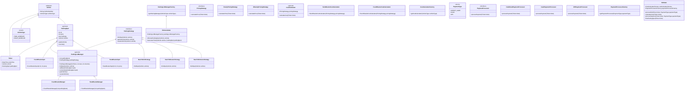

```mermaid
---
id: 03c77620-38fc-4a53-9955-738a30d1e732
---
classDiagram
    ParkingSpot <|-- TwoWheelerSpot
    ParkingSpot <|-- FourWheelerSpot
    ParkingSpot <-- ParkingLotManager
    ParkingSpot <-- Ticket

    Vehicle <-- ParkingSpot
    Vehicle <-- VehicleType
    Vehicle <-- Ticket
    
    ParkingLotManager <|-- TwoWheelerManager
    ParkingLotManager <|-- FourWheelerManager

    ParkingLotManagerFactory <-- EntranceGate

    ParkingStrategy <|-- NearToEntranceStrategy
    ParkingStrategy <|-- NearToElevatorStrategy
    ParkingStrategy <|-- NearToExitStrategy
    ParkingStrategy <-- ParkingLotManager

%% abstract parking spot class
class ParkingSpot{
    <<general>>
    +int id
    +int price
    +bool isEmpty
    +Vehicle Vehicle
    +park(Vehicle)
    +vaccate()
}

%% Concrete parking spot classes
class TwoWheelerSpot {
    +TwoWheelerSpot(int id, int price)
}

class FourWheelerSpot {
    +FourWheelerSpot(int id, int price)
}

class ParkingLotManager {
    <<general>>
    + List<ParkingSpot> parkingSpots
    + ParkingStrategy parkingStrategy
    + ParkingLotManager(int floors, int rows, int columns)
    + findSpot(Vehicle vehicle)
    + addSpot(ParkingSpot spot)
    + removeSpot(ParkingSpot spot)
    + parkVehicle()
    + vacateVehicle()
}

class TwoWheelerManager {
    + TwoWheelerManager(List<ParkingSpot> parkingSpots)
}

class FourWheelerManager {
    + FourWheelerManager(List<ParkingSpot> parkingSpots)
}

class ParkingLotManagerFactory {
    +getParkingManager(VehicleType vehicleType)
}


class ParkingStrategy {
    <<interface>>
    +findSpot(Vehicle vehicle)
    +parkVehicle(Vehicle vehicle)
    +vacateVehicle(Vehicle vehicle)
}

class NearToEntranceStrategy {
    +findSpot(Vehicle vehicle)
}
class NearToElevatorStrategy {
    +findSpot(Vehicle vehicle)
}
class NearToExitStrategy {
    +findSpot(Vehicle vehicle)
}

class Vehicle {
    <<abstract>>
    +String VehicleNumber
    +VehicleType vehicleType
}

class VehicleType {
    <<enum>>
    +TWO_WHEELER
    +FOUR_WHEELER
}

class Ticket {
    +DateTime entryTime
    +Vehicle vehicle
    +ParkingSpot parkingSpot
}

class EntranceGate {
    +ParkingLotManagerFactory parkingLotManagerFactory
    +AllocateParkingSpot(Vehicle vehicle)
    +GenerateTicket(Vehicle vehicle, ParkingSpot parkingSpot)
}

class PricingStrategy {
    <<interface>>
    +calculatePrice(Ticket ticket)
}

class HourlyPricingStrategy {
    +calculatePrice(Ticket ticket)
}

class MinutelyPricingStrategy {
    +calculatePrice(Ticket ticket)
}

class CostCalculator {
    <<general>>
    +PricingStrategy pricingStrategy
    +calculateCost(Ticket ticket)
}

class TwoWheelerCostCalculator {
    +TwoWheelerCostCalculator(PricingStrategy pricingStrategy)
}
class FourWheelerCostCalculator {
    +FourWheelerCostCalculator(PricingStrategy pricingStrategy)
}

class CostCalculatorFactory {
    +getCostCalculator(VehicleType vehicleType)
}

class PaymentType {
    <<enum>>
    +CREDIT_CARD
    +CASH
    +UPI
}
class PaymentProcessor {
    <<interface>>
    +processPayment(Ticket ticket)
}
class CreditCardPaymentProcessor {
    +processPayment(Ticket ticket)
}
class CashPaymentProcessor {
    +processPayment(Ticket ticket)
}
class UPIPaymentProcessor {
    +processPayment(Ticket ticket)
}
class PaymentProcessorFactory {
    +getPaymentProcessor(PaymentType paymentType)
}

class ExitGate {
    +CostCalculatorFactory costCalculatorFactory
    +PaymentProcessorFactory paymentProcessorFactory
    +processExit(Ticket ticket, PaymentType paymentType)
    +calculateCost(Ticket ticket)
    +processPayment(Ticket ticket, PaymentType paymentType)
    +freeParkingSpot(Ticket ticket)
}
```